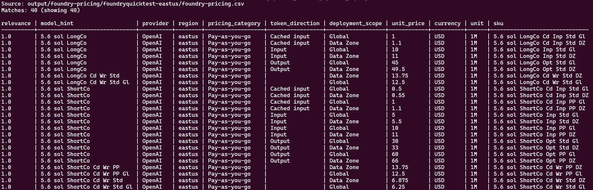

# Foundry Model Pricing Toolkit

> 🔎 Discover regional models, compare Microsoft Foundry retail pricing, inspect
> provisioned throughput (PTU) availability, and search the resulting CSVs.

This standalone toolkit is not integrated with the application. It uses the
Azure CLI for authenticated Azure Resource Manager requests and Python's
standard library for HTTP, JSON, CSV, filtering, and fuzzy matching.

Want to inspect the raw requests? See the
[standalone API examples](api-examples/README.md) for Bash and PowerShell
commands covering every data source used by the toolkit.

## 📦 Download only the toolkit

You do not need to clone the full repository. Download
`foundry-pricing-toolkit.zip` from the
[latest GitHub release](https://github.com/bschooled/Azure-Comparative-Regional-Analysis/releases/latest)
and extract it:

**Bash**

```bash
gh release download \
  --repo bschooled/Azure-Comparative-Regional-Analysis \
  --pattern foundry-pricing-toolkit.zip
unzip foundry-pricing-toolkit.zip
```

**PowerShell**

```powershell
gh release download `
  --repo bschooled/Azure-Comparative-Regional-Analysis `
  --pattern foundry-pricing-toolkit.zip
Expand-Archive .\foundry-pricing-toolkit.zip -DestinationPath .
```

The archive contains one `foundry-pricing/` directory:

| Entry point | Platform |
|---|---|
| `foundry_pricing_probe.sh` | Bash on Linux or macOS |
| `foundry_pricing_probe.ps1` | PowerShell on Windows, Linux, or macOS |
| `foundry_pricing_query.sh` | Bash CSV search interface |
| `foundry_pricing_query.ps1` | PowerShell CSV search interface |
| `python/` | Shared dependency-free Python implementation |
| `api-examples/README.md` | Raw API requests with Bash and PowerShell examples |

## ✨ What it collects

| Data | Source | Authentication | Primary output |
|---|---|---:|---|
| Regional model and deployment SKU availability | Azure AI Services ARM API | Required | `foundry-models.csv` |
| PTU-capable model SKUs | Azure AI Services ARM API | Required | `foundry-ptu-models.csv` |
| Regional PTU quota and remaining capacity | Azure AI Services ARM API | Required | `foundry-ptu-quota.csv` |
| Consumption, reservation, token, and PTU prices | Azure Retail Prices API | No | `foundry-pricing.csv` |
| Subscription Rate Card | Microsoft Commerce API | Optional | `authenticated-rate-card.json` |
| Negotiated Price Sheet | Microsoft Consumption API | Optional | `authenticated-price-sheet.json` |
| Fireworks registry catalog | Azure Machine Learning registry | Optional | `fireworks-catalog.csv` |

The authenticated pricing endpoints depend on the subscription's billing
agreement, offer type, and the signed-in identity's billing permissions.
An unavailable endpoint is reported in `authenticated-pricing-status.json`;
it is not treated as an empty price list.

## ✅ Prerequisites

- Python **3.10 or newer**
- Azure CLI for model, quota, project, or authenticated pricing queries
- An authenticated Azure CLI session: `az login`
- Bash or PowerShell for the platform-specific launcher
- Optional: Azure CLI `ml` extension for `--query-fireworks-catalog`

No `jq`, `curl`, or third-party Python packages are required.

### macOS

Install current dependencies with Homebrew if they are not already available:

```bash
brew install python azure-cli
az login
```

The shell entry points automatically locate `python3` or a compatible
`python` executable.

### Windows

Install current Python and Azure CLI releases, then authenticate:

```powershell
az login
```

PowerShell launchers first try the Windows `py` launcher and then fall back to
`python3` or `python`.

## 🚀 Collect pricing and model data

Use the entry point for your shell and installation:

| Environment | Bash | PowerShell |
|---|---|---|
| Repository root | `./scripts/foundry-pricing/foundry_pricing_probe.sh` | `.\scripts\foundry-pricing\foundry_pricing_probe.ps1` |
| Extracted package parent | `./foundry-pricing/foundry_pricing_probe.sh` | `.\foundry-pricing\foundry_pricing_probe.ps1` |

The examples below show repository paths. For an extracted package, remove
`scripts/` from the path.

### Foundry resource and its default region

When `--region` is omitted, the account location is used:

**Bash**

```bash
./scripts/foundry-pricing/foundry_pricing_probe.sh \
  --resource-group rg-example-ai \
  --account foundry-example \
  --project project-example
```

**PowerShell**

```powershell
.\scripts\foundry-pricing\foundry_pricing_probe.ps1 `
  --resource-group rg-example-ai `
  --account foundry-example `
  --project project-example
```

The project is optional. Omit `--project` when project validation is not
needed.

### Multiple regions

Repeat `--region` or provide a comma-separated list:

**Bash**

```bash
./scripts/foundry-pricing/foundry_pricing_probe.sh \
  --resource-group rg-example-ai \
  --account foundry-example \
  --region eastus2 \
  --region swedencentral
```

**PowerShell**

```powershell
.\scripts\foundry-pricing\foundry_pricing_probe.ps1 `
  --resource-group rg-example-ai `
  --account foundry-example `
  --region eastus2 `
  --region swedencentral
```

Comma-separated values work in both shells:

```text
--region eastus2,westeurope
```

**Bash**

```bash
./scripts/foundry-pricing/foundry_pricing_probe.sh \
  --resource-group rg-example-ai \
  --account foundry-example \
  --region eastus2,westeurope
```

**PowerShell**

```powershell
.\scripts\foundry-pricing\foundry_pricing_probe.ps1 `
  --resource-group rg-example-ai `
  --account foundry-example `
  --region eastus2,westeurope
```

### 🌐 Retail Prices without Azure access

Retail-only mode does not require Azure CLI or access to a Foundry resource:

**Bash**

```bash
./scripts/foundry-pricing/foundry_pricing_probe.sh \
  --retail-only \
  --region eastus2,westeurope
```

**PowerShell**

```powershell
.\scripts\foundry-pricing\foundry_pricing_probe.ps1 `
  --retail-only `
  --region eastus2,westeurope
```

Limit results to one or more exact Retail Prices `productName` values:

**Bash**

```bash
./scripts/foundry-pricing/foundry_pricing_probe.sh \
  --retail-only \
  --region eastus2 \
  --product "Azure Fireworks Models" \
  --product "Azure OpenAI"
```

**PowerShell**

```powershell
.\scripts\foundry-pricing\foundry_pricing_probe.ps1 `
  --retail-only `
  --region eastus2 `
  --product "Azure Fireworks Models" `
  --product "Azure OpenAI"
```

### 🔐 Authenticated pricing APIs

Authenticated pricing is deliberately disabled unless
`--authenticated-pricing` is supplied:

**Bash**

```bash
./scripts/foundry-pricing/foundry_pricing_probe.sh \
  --resource-group rg-example-ai \
  --account foundry-example \
  --region eastus2 \
  --authenticated-pricing
```

**PowerShell**

```powershell
.\scripts\foundry-pricing\foundry_pricing_probe.ps1 `
  --resource-group rg-example-ai `
  --account foundry-example `
  --region eastus2 `
  --authenticated-pricing
```

Override the subscription offer used by the legacy Rate Card API:

**Bash**

```bash
./scripts/foundry-pricing/foundry_pricing_probe.sh \
  --resource-group rg-example-ai \
  --account foundry-example \
  --region eastus2 \
  --authenticated-pricing \
  --rate-card-offer-id MS-AZR-0003P \
  --rate-card-locale en-US \
  --rate-card-region US
```

**PowerShell**

```powershell
.\scripts\foundry-pricing\foundry_pricing_probe.ps1 `
  --resource-group rg-example-ai `
  --account foundry-example `
  --region eastus2 `
  --authenticated-pricing `
  --rate-card-offer-id MS-AZR-0003P `
  --rate-card-locale en-US `
  --rate-card-region US
```

For a billing-profile-scoped negotiated Price Sheet:

**Bash**

```bash
./scripts/foundry-pricing/foundry_pricing_probe.sh \
  --resource-group rg-example-ai \
  --account foundry-example \
  --region eastus2 \
  --authenticated-pricing \
  --billing-account BILLING_ACCOUNT_ID \
  --billing-profile BILLING_PROFILE_ID
```

**PowerShell**

```powershell
.\scripts\foundry-pricing\foundry_pricing_probe.ps1 `
  --resource-group rg-example-ai `
  --account foundry-example `
  --region eastus2 `
  --authenticated-pricing `
  --billing-account BILLING_ACCOUNT_ID `
  --billing-profile BILLING_PROFILE_ID
```

### 🎆 Optional Fireworks catalog

**Bash**

```bash
az extension add --name ml

./scripts/foundry-pricing/foundry_pricing_probe.sh \
  --resource-group rg-example-ai \
  --account foundry-example \
  --region eastus2 \
  --query-fireworks-catalog
```

**PowerShell**

```powershell
az extension add --name ml

.\scripts\foundry-pricing\foundry_pricing_probe.ps1 `
  --resource-group rg-example-ai `
  --account foundry-example `
  --region eastus2 `
  --query-fireworks-catalog
```

Failure of the optional registry query does not discard model, quota, or
pricing results.

## 📁 Output files

By default, files are written beneath:

```text
<toolkit-directory>/output/<account-or-retail>-<regions>/
```

The output directory is created next to the launchers, whether the toolkit is
run from a repository checkout or an extracted release package. It is excluded
by the toolkit's `.gitignore`, so generated JSON and CSV files cannot be
accidentally committed. Use `--output-dir` to select another location; when
choosing a path inside a Git repository, ensure that custom path is also
ignored.

| File | Contents |
|---|---|
| `foundry-pricing.csv` | Normalized Retail Prices rows across the selected regions |
| `foundry-models.csv` | One row per regional model version and deployment SKU |
| `foundry-ptu-models.csv` | Model/SKU rows supporting a provisioned deployment type |
| `foundry-ptu-quota.csv` | PTU quota limits, current use, and remaining capacity |
| `summary.json` | Counts, selected inputs, and optional API status |
| `retail-<region>.json` | Raw Retail Prices data for a region |
| `models-<region>.json` | Raw regional model API response |
| `quota-<region>.json` | Raw regional usage/quota response |
| `retail-vs-authenticated.csv` | Meter-ID matches when Rate Card data is available |

The primary pricing CSV includes:

- 🧠 normalized model hint and provider
- 🌍 Azure region and deployment scope
- 📥 input, cached-input, or output direction
- 💳 unit price, currency, unit, and price type
- 📆 reservation term and effective date
- 🔗 meter ID, ARM SKU, and source

## 🔍 Search the pricing CSV

The query script uses the newest
`<toolkit-directory>/output/**/foundry-pricing.csv` by default:

**Bash**

```bash
./scripts/foundry-pricing/foundry_pricing_query.sh sol
```

**PowerShell**

```powershell
.\scripts\foundry-pricing\foundry_pricing_query.ps1 sol
```



A fuzzy search can tolerate minor spelling errors:

**Bash**

```bash
./scripts/foundry-pricing/foundry_pricing_query.sh firewroks
```

**PowerShell**

```powershell
.\scripts\foundry-pricing\foundry_pricing_query.ps1 firewroks
```

Useful filters can be combined:

**Bash**

```bash
# Fireworks models below a unit-price threshold
./scripts/foundry-pricing/foundry_pricing_query.sh kimi \
  --fireworks-only \
  --max-price 0.01 \
  --sort price

# Global provisioned-throughput meters
./scripts/foundry-pricing/foundry_pricing_query.sh \
  --ptu-only \
  --scope global \
  --sort price

# Input pricing in selected regions
./scripts/foundry-pricing/foundry_pricing_query.sh gpt-5 \
  --region eastus2,westeurope \
  --direction input

# Machine-readable results from a specific file
./scripts/foundry-pricing/foundry_pricing_query.sh mistral \
  --csv scripts/foundry-pricing/output/example/foundry-pricing.csv \
  --json
```

**PowerShell**

```powershell
# Fireworks models below a unit-price threshold
.\scripts\foundry-pricing\foundry_pricing_query.ps1 kimi `
  --fireworks-only `
  --max-price 0.01 `
  --sort price

# Global provisioned-throughput meters
.\scripts\foundry-pricing\foundry_pricing_query.ps1 `
  --ptu-only `
  --scope global `
  --sort price

# Input pricing in selected regions
.\scripts\foundry-pricing\foundry_pricing_query.ps1 gpt-5 `
  --region eastus2,westeurope `
  --direction input

# Machine-readable results from a specific file
.\scripts\foundry-pricing\foundry_pricing_query.ps1 mistral `
  --csv .\scripts\foundry-pricing\output\example\foundry-pricing.csv `
  --json
```

Additional filters include `--provider`, `--product`, `--sku`, `--category`,
`--price-type`, `--unit`, `--min-price`, `--max-price`, and `--threshold`.
Use `--columns` to choose table columns and `--limit` to control result count.

## ⚙️ Common collector flags

| Flag | Purpose |
|---|---|
| `--region` | Select a region; repeat or use comma-separated values |
| `--currency` | Retail Prices currency code, such as `USD` or `EUR` |
| `--product` | Restrict Retail Prices to an exact product name |
| `--retail-only` | Run without Azure CLI or Foundry resource access |
| `--skip-retail` | Collect only ARM model and quota information |
| `--authenticated-pricing` | Enable Rate Card and Price Sheet probes |
| `--query-fireworks-catalog` | Query the optional Fireworks Azure ML registry |
| `--subscription` | Override the active Azure CLI subscription |
| `--output-dir` | Select the output location |
| `--timeout` | Set HTTP and Azure CLI timeout seconds |
| `--verbose` | Print external commands and pagination progress |

For the complete option list:

**Bash**

```bash
./scripts/foundry-pricing/foundry_pricing_probe.sh --help
./scripts/foundry-pricing/foundry_pricing_query.sh --help
```

**PowerShell**

```powershell
.\scripts\foundry-pricing\foundry_pricing_probe.ps1 --help
.\scripts\foundry-pricing\foundry_pricing_query.ps1 --help
```

## 📚 Official Microsoft references

The implementation is based on these Microsoft references:

- [Azure Retail Prices overview and API syntax](https://learn.microsoft.com/rest/api/cost-management/retail-prices/azure-retail-prices)
- [Azure AI Services Models - List REST API](https://learn.microsoft.com/rest/api/aiservices/accountmanagement/models/list?view=rest-aiservices-accountmanagement-2024-10-01)
- [Azure AI Services Usages - List REST API](https://learn.microsoft.com/rest/api/aiservices/accountmanagement/usages/list?view=rest-aiservices-accountmanagement-2024-10-01)
- [Azure Consumption Price Sheet - Get REST API](https://learn.microsoft.com/rest/api/consumption/price-sheet/get?view=rest-consumption-2023-05-01)
- [Azure Rate Card resources](https://learn.microsoft.com/partner-center/developer/azure-rate-card-resources)
- [Azure CLI `az rest` reference](https://learn.microsoft.com/cli/azure/reference-index#az-rest)
- [Azure CLI `az cognitiveservices account`](https://learn.microsoft.com/cli/azure/cognitiveservices/account)
- [Azure CLI `az ml model list`](https://learn.microsoft.com/cli/azure/ml/model#az-ml-model-list)
- [Microsoft Foundry Models overview](https://learn.microsoft.com/azure/foundry/concepts/foundry-models-overview)
- [Foundry Models sold directly by Azure](https://learn.microsoft.com/azure/foundry/foundry-models/concepts/models-sold-directly-by-azure)
- [Microsoft Foundry model deployment types](https://learn.microsoft.com/azure/foundry/foundry-models/concepts/deployment-types)

> ⚠️ Retail Prices are public list prices. They do not automatically represent
> negotiated enterprise pricing, credits, reservations already purchased, tax,
> or a subscription-specific discount.
